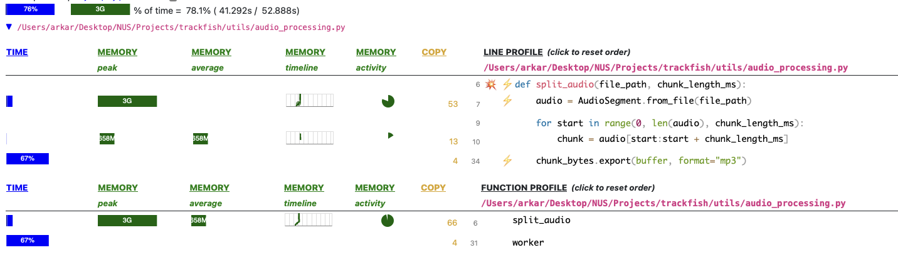
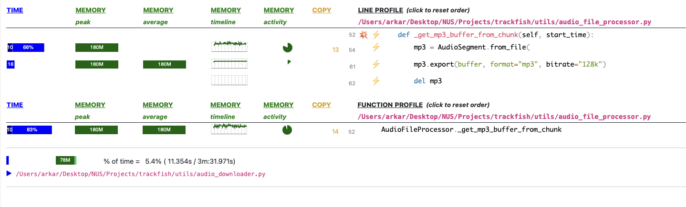
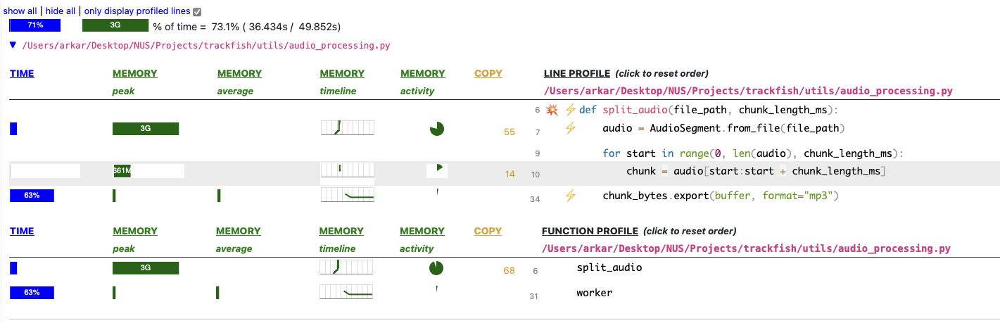
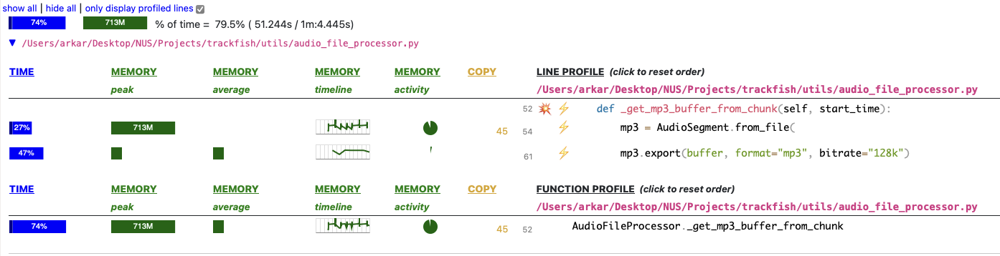

# CrateDigger

🐡 Comment "ID?" on DJ mixes no more 😎

The application is deployed on [Streamlit](https://cratedigger.streamlit.app/)

## Overview

CrateDigger is a Streamlit-based application that allows users to upload audio files or provide links to DJ mixes from platforms like YouTube or SoundCloud. The application then breaks these audio sources into user-defined chunks and queries each chunk against the Shazam API to identify tracks. This README documents the key technical iterations and optimizations made during the development journey of CrateDigger.

## Key Technical Iterations

### Initial Implementation

1. **Chunking and Querying with `ThreadPoolExecutor`**
    - Initially, `ThreadPoolExecutor` was used to handle the chunking and querying process. This approach was chosen because the task was IO-bound, primarily involving exporting audio chunks as MP3 files and making POST requests to the Shazam API.
    - However, as the size of audio sources increased, the overhead of managing multiple threads became too large. The threads only performed relatively lightweight tasks, so the benefits of multithreading were outweighed by the overhead.

2. **Refactoring to `aiohttp`**
    - To address the inefficiency with `ThreadPoolExecutor`, the implementation was refactored to use `aiohttp` for asynchronous processing. This change reduced the overhead and improved the performance for larger audio sources.

### Memory Management

**Key achievement** : Reduced memory consumption from 3GB to <800MB

1. **Memory Limitations on Streamlit**
    - CrateDigger is hosted on Streamlit, which imposes a RAM limit of less than 2.7GB. Initially, the application could handle audio sources less than an hour long. However, for mixes around 1 hour, which are common, the application would be killed by Streamlit due to memory constraints.
    - To address this, memory profiling was conducted using `scalene`.

2. **Memory Profiling with `scalene`**
    - Profiling revealed that the main memory consumption came from audio processing. Specifically, `pydub.AudioSegment.from_file` loads the entire audio file into memory, consuming about 3GB of RAM for a 1-hour audio source.
    - Despite its memory consumption, `pydub.AudioSegment` was necessary because it allows developers to write a section of audio as an MP3 file, which is required for the POST body in Shazam API queries.

3. **Optimizing Audio Processing**
    - To reduce memory usage, `soundfile` was used to calculate the duration of the audio source, avoiding loading the entire file into memory.
    - Additionally, an alternative approach was employed to generate MP3 files without loading the entire audio file. This involved creating an MP3 file directly from a specified segment of the source audio:
    ```python
    AudioSegment.from_file(file, start_second, duration, format="mp3")
    ```

`mem_profile_test` provides a helper to test an audio source about 1 hour long.

> Note
>
> You may wish to use a mock API to avoid API latencies

```bash
scalene --memory mem_profile_test.py
```

### Observing memory consumption

Following tests were done with a 1-hour DJ mix

#### Chunk size of `60s`
##### Initial performance


##### Refactored performance


#### Chunk size of `600s`
##### Initial performance


##### Refactored performance



## Developer Guide

1. Install Python modules:
    ```bash
    pip install -r requirements.txt
    ```
2. Create secrets for Shazam API:
    - Create a directory called `.streamlit`
    - Create a file called `secrets.toml`
    - Enter your `api_key` in the following format in `secrets.toml` file:
    ```bash
    api_key = "<your-api-key>"
    ```
3. Start local Streamlit app:
    ```bash
    make app
    ```

## App structure

`index.py` is the entry point

```bash
.
├── Makefile
├── README.md
├── app.py
├── clip
├── components
│   ├── __init__.py
│   ├── intro.py
│   ├── notice.py
│   ├── track_form.py
│   └── track_list.py
├── config
│   ├── __init__.py
│   └── config.py
├── index.py
├── mem_profile_test.py
├── packages.txt
├── requirements.txt
├── tracks_exceptions
│   ├── InvalidUrlException.py
│   ├── MixTooBigException.py
│   ├── NoSourceException.py
│   ├── TooManySourceException.py
│   └── __init__.py
└── utils
    ├── __init__.py
    ├── audio_downloader.py
    ├── audio_file_processor.py
    ├── audio_processing.py
    ├── models.py
    ├── querier.py
    └── storage.py

```

### `components`
- Streamlit UI components
#### `intro`
Intro text
#### `track_form`
Components to let user upload, paste links and select scan frequency
#### `track_list`
Render tracklist as a table

### `utils`
#### `querier`
- Validates user input files and URLs
- Queries `audio_processing` based on user's track source

#### `audio_file_processor`
Main worker that processes uploaded files and queries shazam api

#### `audio_processing`
> DEPRACATED, high memory consumption
Main worker that processes uploaded files and queries shazam api